# Highlight.js Themes Showcase

A comprehensive visual guide to all available [Highlight.js](https://highlightjs.org/) themes, showcasing syntax highlighting for Python code. 


## 🎯 Theme Gallery

#### 1c Light
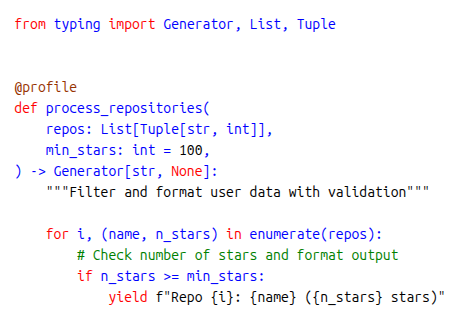

#### A11y Dark


#### A11y Light


#### Agate


#### An Old Hope
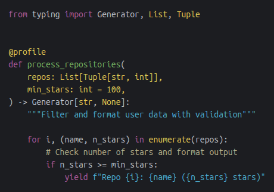

#### Androidstudio


#### Arduino Light


#### Arta
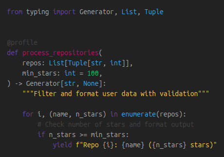

#### Ascetic


#### Atom One Dark


#### Atom One Dark Reasonable
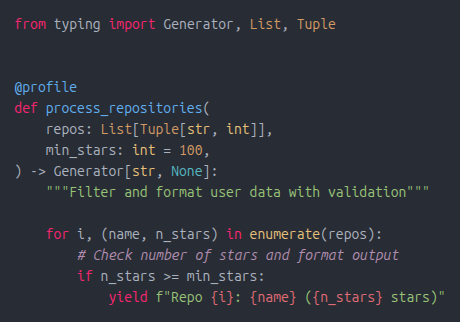

#### Atom One Light


#### Brown Paper


#### Codepen Embed


#### Color Brewer


#### Cybertopia Cherry


#### Cybertopia Dimmer


#### Cybertopia Icecap


#### Cybertopia Saturated


#### Dark


#### Default


#### Devibeans


#### Docco


#### Far


#### Felipec
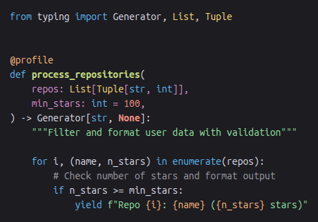

#### Foundation


#### Github


#### Github Dark


#### Github Dark Dimmed


#### Gml


#### Googlecode


#### Gradient Dark


#### Gradient Light


#### Grayscale


#### Hybrid


#### Idea
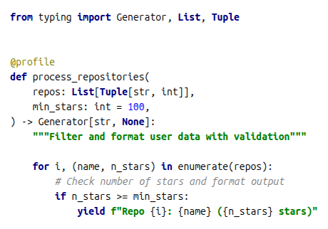

#### Intellij Light


#### Ir Black
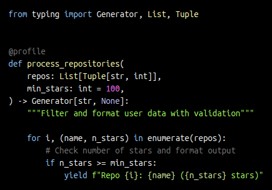

#### Isbl Editor Dark
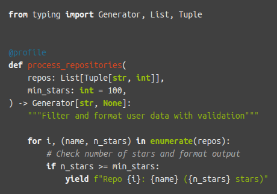

#### Isbl Editor Light
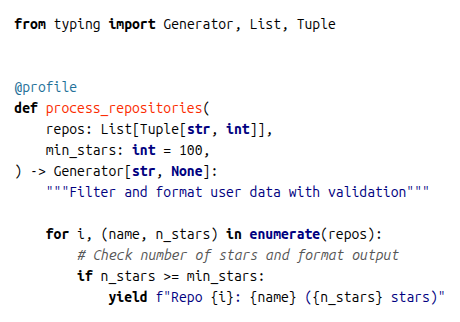

#### Kimbie Dark
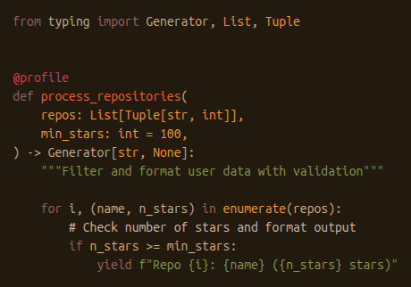

#### Kimbie Light


#### Lightfair


#### Lioshi


#### Magula


#### Mono Blue


#### Monokai
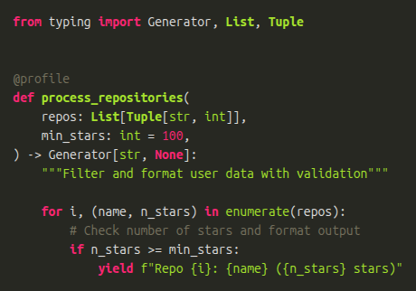

#### Monokai Sublime
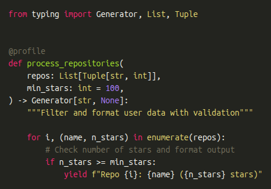

#### Night Owl


#### Nnfx Dark
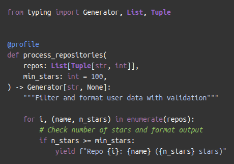

#### Nnfx Light


#### Nord
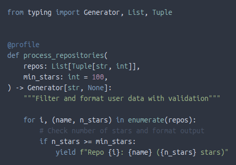

#### Obsidian
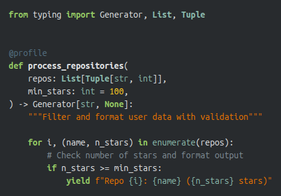

#### Panda Syntax Dark
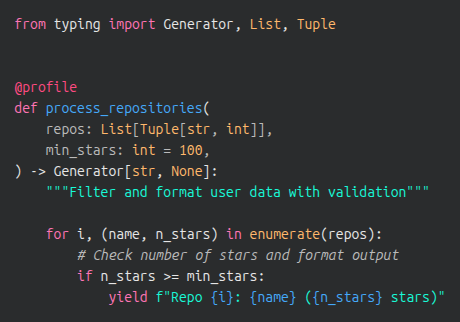

#### Panda Syntax Light


#### Paraiso Dark
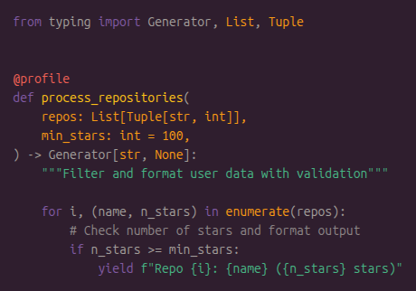

#### Paraiso Light
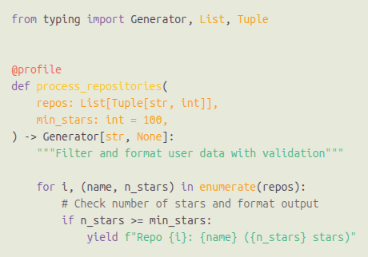

#### Pojoaque


#### Purebasic
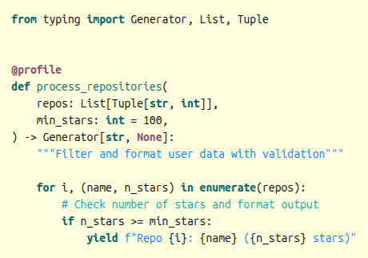

#### Qtcreator Dark
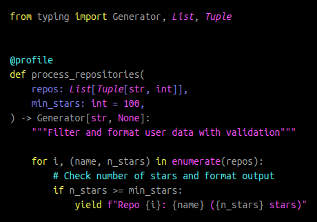

#### Qtcreator Light


#### Rainbow


#### Rose Pine
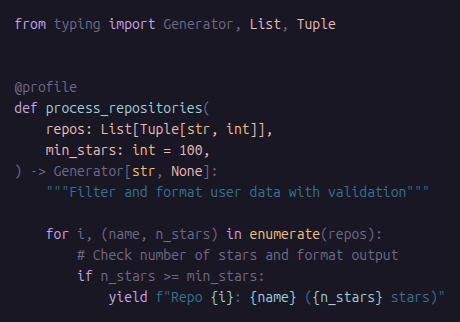

#### Rose Pine Dawn


#### Rose Pine Moon


#### Routeros
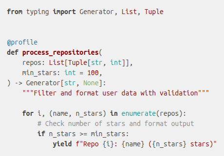

#### School Book
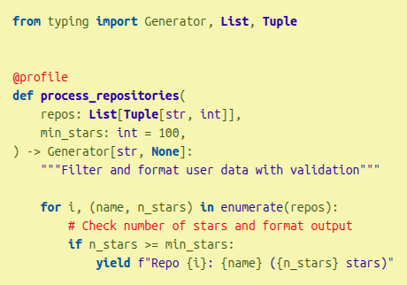

#### Shades Of Purple
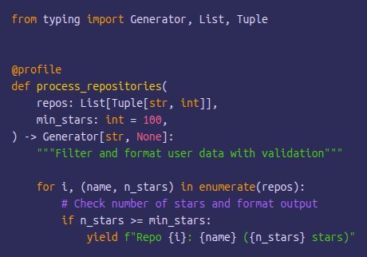

#### Srcery
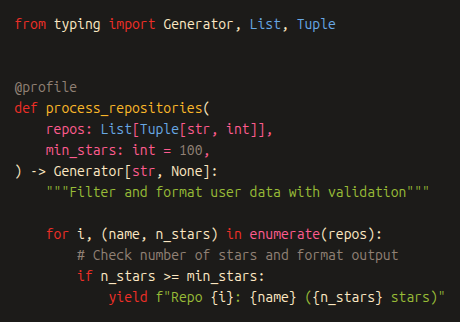

#### Stackoverflow Dark


#### Stackoverflow Light
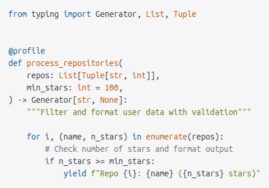

#### Sunburst
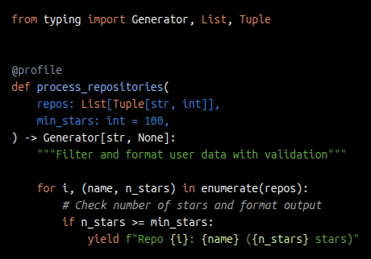

#### Tokyo Night Dark


#### Tokyo Night Light
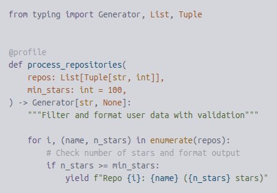

#### Tomorrow Night Blue


#### Tomorrow Night Bright
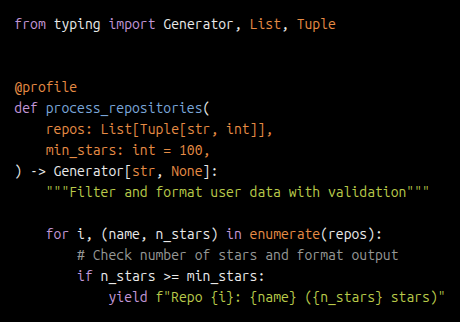

#### Vs
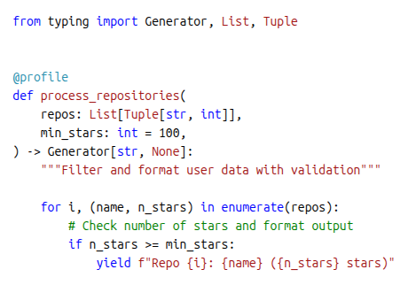

#### Vs2015
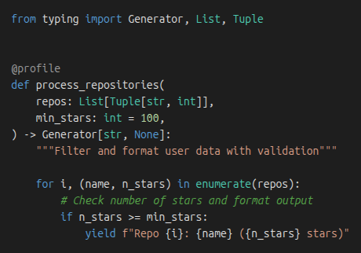

#### Xcode
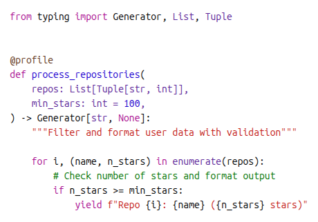

#### Xt256


#### Base16 / 3024


#### Base16 / Apathy
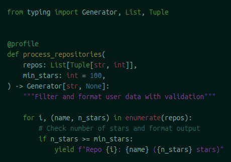

#### Base16 / Apprentice


#### Base16 / Ashes
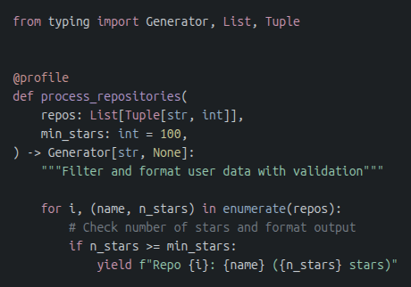

#### Base16 / Atelier Cave
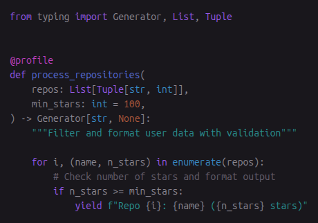

#### Base16 / Atelier Cave Light
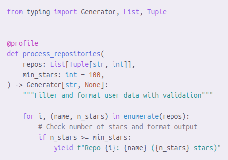

#### Base16 / Atelier Dune
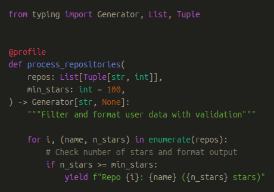

#### Base16 / Atelier Dune Light


#### Base16 / Atelier Estuary
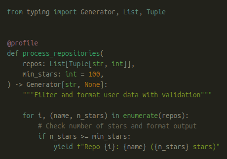

#### Base16 / Atelier Estuary Light
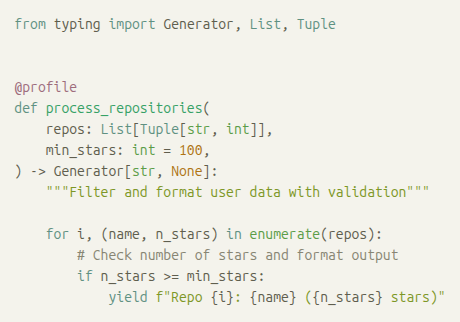

#### Base16 / Atelier Forest
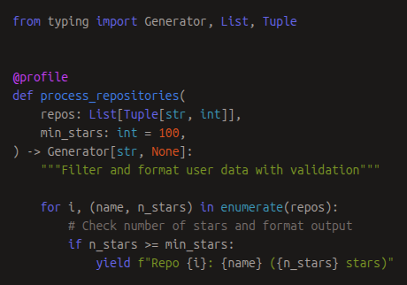

#### Base16 / Atelier Forest Light
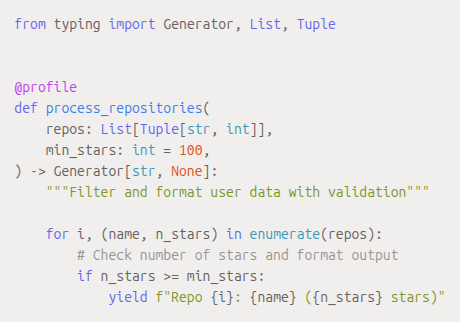

#### Base16 / Atelier Heath


#### Base16 / Atelier Heath Light


#### Base16 / Atelier Lakeside
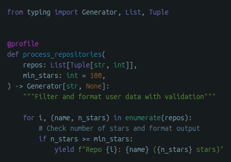

#### Base16 / Atelier Lakeside Light


#### Base16 / Atelier Plateau


#### Base16 / Atelier Plateau Light
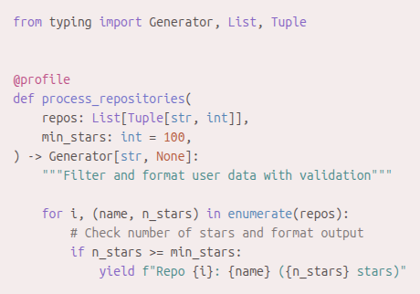

#### Base16 / Atelier Savanna


#### Base16 / Atelier Savanna Light
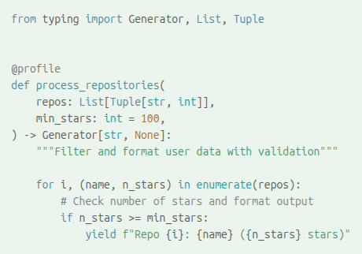

#### Base16 / Atelier Seaside
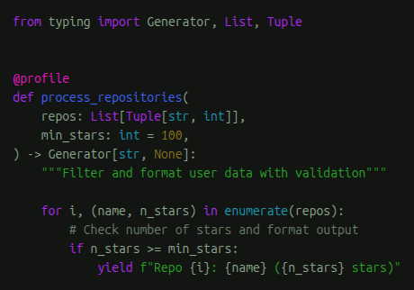

#### Base16 / Atelier Seaside Light


#### Base16 / Atelier Sulphurpool
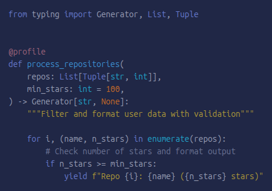

#### Base16 / Atelier Sulphurpool Light
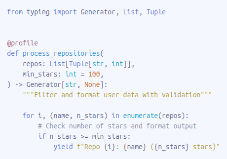

#### Base16 / Atlas


#### Base16 / Bespin
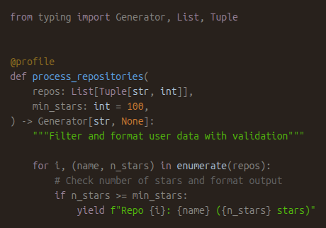

#### Base16 / Black Metal


#### Base16 / Black Metal Bathory


#### Base16 / Black Metal Burzum
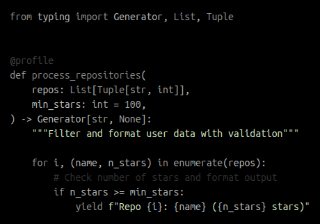

#### Base16 / Black Metal Dark Funeral


#### Base16 / Black Metal Gorgoroth


#### Base16 / Black Metal Immortal


#### Base16 / Black Metal Khold
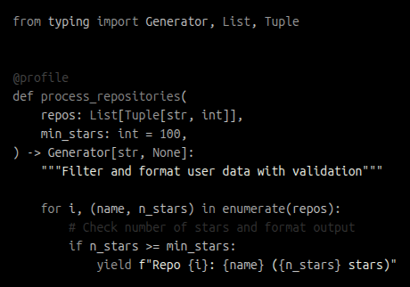

#### Base16 / Black Metal Marduk


#### Base16 / Black Metal Mayhem


#### Base16 / Black Metal Nile


#### Base16 / Black Metal Venom


#### Base16 / Brewer


#### Base16 / Bright


#### Base16 / Brogrammer


#### Base16 / Brush Trees


#### Base16 / Brush Trees Dark


#### Base16 / Chalk


#### Base16 / Circus


#### Base16 / Classic Dark


#### Base16 / Classic Light


#### Base16 / Codeschool


#### Base16 / Colors


#### Base16 / Cupcake


#### Base16 / Cupertino


#### Base16 / Danqing


#### Base16 / Darcula


#### Base16 / Dark Violet


#### Base16 / Darkmoss


#### Base16 / Darktooth


#### Base16 / Decaf


#### Base16 / Default Dark


#### Base16 / Default Light


#### Base16 / Dirtysea


#### Base16 / Dracula


#### Base16 / Edge Dark


#### Base16 / Edge Light


#### Base16 / Eighties


#### Base16 / Embers


#### Base16 / Equilibrium Dark


#### Base16 / Equilibrium Gray Dark


#### Base16 / Equilibrium Gray Light


#### Base16 / Equilibrium Light


#### Base16 / Espresso


#### Base16 / Eva


#### Base16 / Eva Dim


#### Base16 / Flat


#### Base16 / Framer


#### Base16 / Fruit Soda


#### Base16 / Gigavolt


#### Base16 / Github


#### Base16 / Google Dark


#### Base16 / Google Light


#### Base16 / Grayscale Dark


#### Base16 / Grayscale Light


#### Base16 / Green Screen


#### Base16 / Gruvbox Dark Hard


#### Base16 / Gruvbox Dark Medium


#### Base16 / Gruvbox Dark Pale


#### Base16 / Gruvbox Dark Soft


#### Base16 / Gruvbox Light Hard


#### Base16 / Gruvbox Light Medium


#### Base16 / Gruvbox Light Soft


#### Base16 / Hardcore


#### Base16 / Harmonic16 Dark


#### Base16 / Harmonic16 Light


#### Base16 / Heetch Dark


#### Base16 / Heetch Light


#### Base16 / Helios


#### Base16 / Hopscotch


#### Base16 / Horizon Dark


#### Base16 / Horizon Light


#### Base16 / Humanoid Dark


#### Base16 / Humanoid Light


#### Base16 / Ia Dark


#### Base16 / Ia Light


#### Base16 / Icy Dark


#### Base16 / Ir Black


#### Base16 / Isotope


#### Base16 / Kimber


#### Base16 / London Tube


#### Base16 / Macintosh


#### Base16 / Marrakesh


#### Base16 / Materia


#### Base16 / Material


#### Base16 / Material Darker


#### Base16 / Material Lighter


#### Base16 / Material Palenight


#### Base16 / Material Vivid


#### Base16 / Mellow Purple


#### Base16 / Mexico Light


#### Base16 / Mocha


#### Base16 / Monokai


#### Base16 / Nebula


#### Base16 / Nord


#### Base16 / Nova


#### Base16 / Ocean


#### Base16 / Oceanicnext


#### Base16 / One Light


#### Base16 / Onedark


#### Base16 / Outrun Dark


#### Base16 / Papercolor Dark


#### Base16 / Papercolor Light


#### Base16 / Paraiso


#### Base16 / Pasque


#### Base16 / Phd


#### Base16 / Pico


#### Base16 / Pop


#### Base16 / Porple


#### Base16 / Qualia


#### Base16 / Railscasts


#### Base16 / Rebecca


#### Base16 / Ros Pine


#### Base16 / Ros Pine Dawn


#### Base16 / Ros Pine Moon


#### Base16 / Sagelight


#### Base16 / Sandcastle


#### Base16 / Seti Ui


#### Base16 / Shapeshifter


#### Base16 / Silk Dark


#### Base16 / Silk Light


#### Base16 / Snazzy


#### Base16 / Solar Flare


#### Base16 / Solar Flare Light


#### Base16 / Solarized Dark


#### Base16 / Solarized Light


#### Base16 / Spacemacs


#### Base16 / Summercamp


#### Base16 / Summerfruit Dark


#### Base16 / Summerfruit Light


#### Base16 / Synth Midnight Terminal Dark


#### Base16 / Synth Midnight Terminal Light


#### Base16 / Tango


#### Base16 / Tender


#### Base16 / Tomorrow


#### Base16 / Tomorrow Night


#### Base16 / Twilight


#### Base16 / Unikitty Dark


#### Base16 / Unikitty Light


#### Base16 / Vulcan


#### Base16 / Windows 10


#### Base16 / Windows 10 Light


#### Base16 / Windows 95


#### Base16 / Windows 95 Light


#### Base16 / Windows High Contrast


#### Base16 / Windows High Contrast Light


#### Base16 / Windows Nt


#### Base16 / Windows Nt Light


#### Base16 / Woodland


#### Base16 / Xcode Dusk


#### Base16 / Zenburn


## 🛠️ Technical Details

### Technologies Used
- **Highlight.js 11.9.0** - Syntax highlighting library
- **Puppeteer 24.10.0** - Automated screenshot generation
- **Node.js** - Build system and automation

### Project Structure
```
highlightjs-themes-demo/
├── demo.html              # HTML template for theme display
├── demo-code.py           # Python code snippet used in all themes
├── package.json           # Project dependencies
├── scripts/
│   └── generate.js  # Discovers themes and captures screenshots with Puppeteer
└── screenshots/           # Generated PNG screenshots for each theme
    ├── a11y-dark.png
    ├── a11y-light.png
    └── ... (256 total)
```

### Syntax Elements Showcased
The demo Python code demonstrates syntax highlighting for:
- **Import statements** (`import asyncio`, `from typing`)
- **Decorators** (`@property`)
- **Type annotations** (`List[str]`, `AsyncGenerator[str, None]`)
- **Async/generators** (`async def`, `yield`, `AsyncGenerator`)
- **Docstrings** (function documentation strings)
- **Regular expressions** (`r"^[a-zA-Z0-9._%+-]+@..."`)
- **F-strings** (`f"Valid: {email} (#{count + 1})"`)
- **String literals** (raw strings, regular strings)
- **Numbers** (`100`, `0.1`, `1`, `2`)
- **Comments** (`# Track processed emails`)
- **Operators** (`>=`, `+`, `+=`)
- **Keywords** (`async`, `await`, `yield`, `if`, `for`, `break`)
- **Built-in functions** (`strip()`, `match()`)

## Running the Generator
To regenerate screenshots or adapt for different code samples:

```bash
# Install dependencies
npm install

# Generate all screenshots (themes are discovered automatically)
node scripts/generate.js
```

## 📊 Statistics
- **Total themes available**: 256
- **Themes displayed**: 256

## 🎨 Popular Themes
Some of the most popular and widely-used themes include:
- **GitHub** - Clean, professional light theme
- **GitHub Dark** - Modern dark variant of GitHub theme
- **Monokai** - Classic dark theme with vibrant colors
- **Atom One Dark** - Popular dark theme from Atom editor
- **VS Code Dark+** (Tomorrow Night) - Default VS Code dark theme
- **Solarized Dark/Light** - Scientifically designed color scheme
- **Nord** - Arctic-inspired cool color palette

